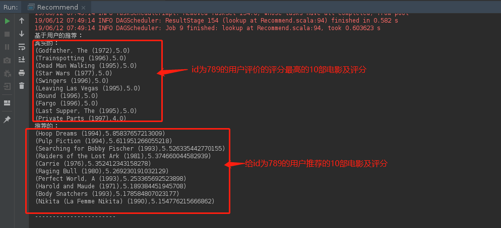
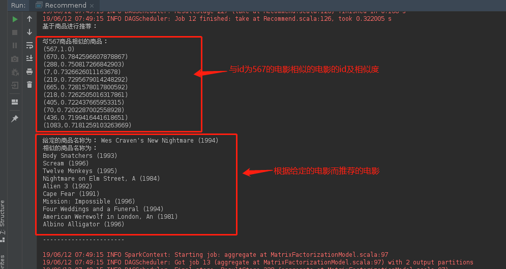

运行代码及相关解释
本实验主要分为两个主类，分别是 MAPKTest，Recommend。

MAPKTest类的主要作用训练模型并进行MAPK评估：

K值平均准确率（MAPK）：

K值平均准确率（MAPK）的意思是整个数据集上的K值平均准确率（APK）的均值。APK是信息检索中常用的一个指标。它用于衡量针对某个查询所返回的“前K个”文档的平均相关性。
如果结果中文档的实际相关性越高且排名也更靠前，那APK分值也就越高。如果在预测结果中得分更高（在推荐列表中排名也更靠前）的物品实际上也与用户更相关，那自然这个模型就更好。

查看代码过程中，需要仔细阅读代码中的注释，理解每段代码所代表的意思及功能

打开MAPKTest类，右击运行，如下图所示：

训练过程打印篇幅较长，需要拉动滑动条到答应结果底部，才能看到打印的结果，如下图所示：

Recommend类主要功能：
1.对数据进行处理

2.基于Spark MLlib 的推荐算法训练模型

3.基于用户进行电影推荐

4.基于商品进行电影推荐

5.对模型进行评估

运行Recommend类（方法与之前的一样），查看运行结果，如下图所示（打印结果信息篇幅较大，需要耐心查看）：

下图是基于用户的推荐为用户id为789的用户推荐的10部电影及评分

下图是基于商品的推荐

由上图可知排名第一的最相似物品就是我们给定的物品。但是注意，因为模型的初始化是随机的，所以后面的商品可能跟你的不一样，这是很正常的